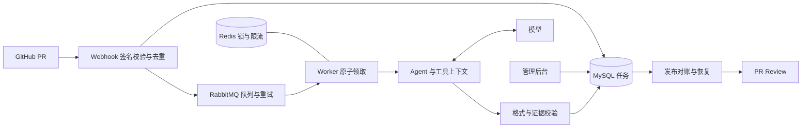

# 完整本地部署与演示

## 启动

需要 Docker Desktop 的 Linux 引擎和支持 `env_file.required` 的 Compose。先运行 `docker info`，确认能返回服务端信息。

在 Windows PowerShell：

```powershell
Set-Location 'D:\Codex\github-pr-review-agent-codex'
if (-not (Test-Path .env)) { Copy-Item compose.env.example .env }
docker compose -p pr-review-demo config --quiet
docker compose -p pr-review-demo up --build -d --wait --wait-timeout 240
docker compose -p pr-review-demo ps
Invoke-RestMethod http://localhost:8080/healthz
```

首次构建会下载镜像、Go 模块并编译。`--wait-timeout` 是容器健康等待时间，不是构建总时长。服务依次等待 MySQL、Redis、RabbitMQ 健康后启动，MySQL migration 随应用启动执行。默认监听本机回环地址。

此配置可在没有模型/GitHub 凭据时启动健康检查和后台；完整 PR 审查仍需真实凭据。打开 [开发者后台](http://localhost:8080/admin)，使用 `.env` 中的 `ADMIN_TOKEN`；示例默认值是 `local-review-token`，仅用于本地演示。

```powershell
$headers = @{ Authorization = 'Bearer local-review-token' }
Invoke-RestMethod http://localhost:8080/tasks -Headers $headers
docker compose -p pr-review-demo logs --tail 100 app
```

修改了管理员 token 时，上述命令使用修改后的值。不要将真实凭据放入截图或演示视频。

## 接入自己的测试 PR

1. 编辑 `.env`，设置 `DEEPSEEK_API_KEY`、`GITHUB_WEBHOOK_SECRET` 和 GitHub App 的 ID、installation ID、PEM 私钥；也可使用仅有个人测试仓库权限的 `GITHUB_TOKEN`。
2. PEM 可以作为单引号包裹的多行 dotenv 值。不要提交 `.env`。数据库和 RabbitMQ 的演示密码若要修改，建议使用随机字母数字，避免 DSN/URL 转义问题。
3. 使用自己配置的 HTTPS 入口转发到本地 8080，把 GitHub App webhook 指向 `/webhook/github`。回调签名密钥必须一致。公网部署应设置 `APP_ENV=production` 并配置真实凭据和独立随机管理员 token。
4. 执行 `docker compose -p pr-review-demo up -d --force-recreate app`，在安装了 App 的测试仓库新建 PR，查看任务、工具轨迹、结果和评论。

应用默认使用 tool-calling。Compose 明确关闭静态检查：本机子进程执行不是强隔离沙箱，不适合直接运行陌生仓库代码。只有受控测试仓库才按 [交付验收](delivery.md) 在专用测试环境执行静态检查专项。不要给应用挂载 Docker socket。

## 架构



GitHub 发布与数据库之间没有共同事务；发布标识、commit 对账和持久化凭证用于恢复，不能宣称全链路 exactly-once。

## 常见问题与停止

- Docker 服务端无响应：先在 Docker Desktop 确认 Linux 引擎已启动。这不同于 Compose 语法校验通过。
- 端口冲突：在 `.env` 设置 `APP_PORT`、`REDIS_PORT`、`RABBITMQ_PORT`、`RABBITMQ_ADMIN_PORT`。应用、Redis、RabbitMQ 的容器内地址不变。
- 老版本 RabbitMQ 数据卷只有旧用户：本指南用新项目名 `pr-review-demo` 隔离数据。不要删除旧数据卷来解决登录问题；生产升级应迁移用户或使用原凭据。
- MySQL 已初始化后修改 `.env` 密码不会自动修改数据库用户密码，需要按数据库账户管理流程修改。不要用删卷替代密码迁移。
- `/healthz` 通过仅代表服务已启动，不证明模型、GitHub 权限或整个发布链路正常。完整验收必须用测试 PR。

停止本演示的服务并保留数据：

```powershell
docker compose -p pr-review-demo down
```

不要附加 `--volumes`，除非明确要删除该演示的数据库和队列数据。

## 30 秒演示脚本

录制前先跑完一个真实 PR，避免视频花在等待模型上。准备结果页面，隐藏 token、私钥和认证请求头。

| 时间 | 操作 | 讲解 |
|---|---|---|
| 0–6 秒 | 展示测试 PR 的缺陷变更 | “提交 PR 后，Webhook 创建异步审查任务。” |
| 6–14 秒 | 后台打开对应任务、工具记录 | “Agent 读取函数、版本和调用方，保留每步工具证据。” |
| 14–23 秒 | 展示 finding 与精确引用，再切到 PR 评论 | “输出经过格式与证据校验后，保存并回写评论。” |
| 23–30 秒 | 展示审计、token 与发布凭证 | “任务支持重试和发布恢复，过程可追踪、可评测。” |

建议截图：任务列表、单个工具输入输出、证据化审查结果、实际 PR 评论。本轮提供脚本，录屏与线上截图须基于实际部署录制，不能用模拟界面冒充。

## 面试问答提纲

- 为什么使用 RabbitMQ？分离 webhook 响应与长时间审查，结合确认、重试和超时恢复处理失败；数据库记录业务状态。
- Redis 锁与数据库 claim 分别解决什么？前者限制同一 PR 的并发，后者避免同一任务被重复领取；锁失效和外部发布仍有边界。
- 为什么有证据还会误报？引用真实不等于推理成立；必须用反例、测试、版本和契约验证语义。
- 为什么格式纠正最多一次？复用已有上下文降低重做成本，并限制额外调用；纠正后仍严格校验。
- 为什么检索不能只看 diff？字段删除影响未修改的调用文件；finding 可以定位到该调用方。
- 如何证明质量提升？冻结标签和提示词，保留数据集指纹，分别报告主集和独立样本、失败率、误报率、召回率及成本；脚本满分不代表模型满分。
- 当前最大限制？live 样本规模较小、语义误报仍存在、静态执行尚非独立沙箱，外部评论与数据库也不是分布式事务。
